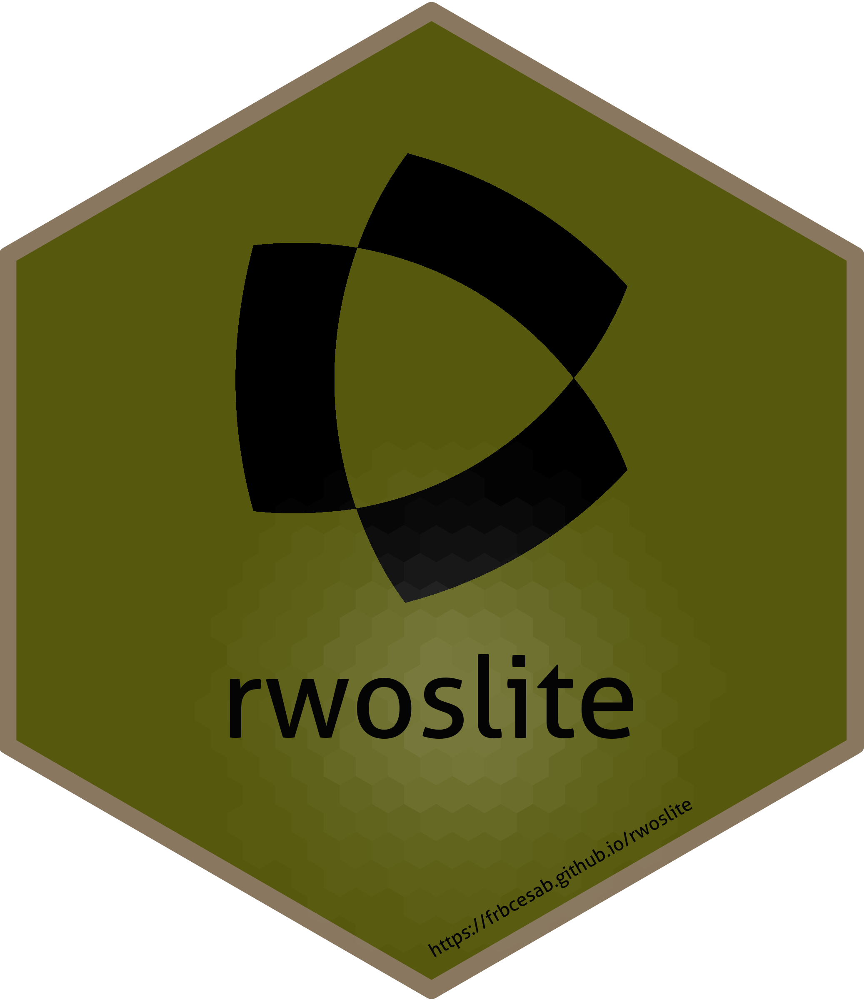

<!-- README.md is generated from README.Rmd. Please edit that file -->

# rwoslite 

<!-- badges: start -->

[](https://github.com/FRBCesab/rwoslite/actions/workflows/R-CMD-check.yaml)
[](https://github.com/FRBCesab/rwoslite/actions/workflows/pkgdown.yaml)
[](https://choosealicense.com/licenses/mit/)
[](https://lifecycle.r-lib.org/articles/stages.html#stable)
[](https://www.repostatus.org/#active)
<!-- badges: end -->

This R package is an interface for the [WOS Lite
API](https://developer.clarivate.com/apis/woslite). This package is
freely released by the
[FRB-CESAB](https://www.fondationbiodiversite.fr/en/about-the-foundation/le-cesab/)
and allows user to retrieve references from a WOS request.

## Requirements

This package uses the WOS Lite API to access data on scientific
literature. You must first have obtained a Personal API Token by
contacting the WOS team.

Then you must store this token as an R Environment variable (i.e. a
name-value pairs). Use the function `usethis::edit_r_environ()` to open
the `~/.Renviron` file and add this line (by replacing z999zzz… with
your token):

    WOS_KEY='z999zzz9zzz999999z9z99zz999zz999'

Save the file and relaunch R.

## Installation

You can install the development version from
[GitHub](https://github.com/) with:

``` r
# install.packages("remotes")
remotes::install_github("FRBCesab/rwoslite")
```

Then you can attach the package `rwoslite`:

``` r
library("rwoslite")
```

## Overview

The general workflow is the following:

-   Use the function `rwoslite::wos_search()` to get the total number of
    references that match the Web of Science query.
-   Use the function `rwoslite::wos_get_records()` to download the
    references.

## Citation

Please cite this package as:

> Casajus N & Mouquet N (2022) rwoslite: An R Client for the WOS Lite
> API. R package version 0.0.0.9000.

## Code of Conduct

Please note that the `rwoslite` project is released with a [Contributor
Code of
Conduct](https://contributor-covenant.org/version/2/0/CODE_OF_CONDUCT.html).
By contributing to this project, you agree to abide by its terms.
